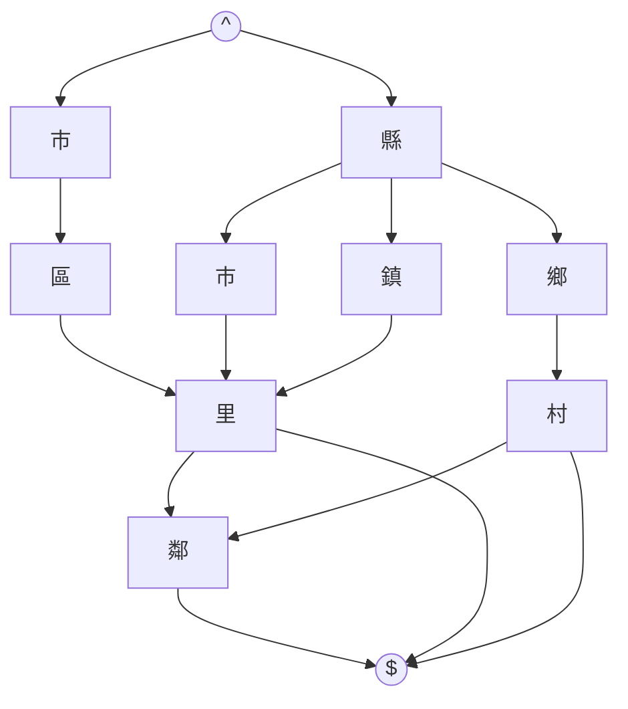
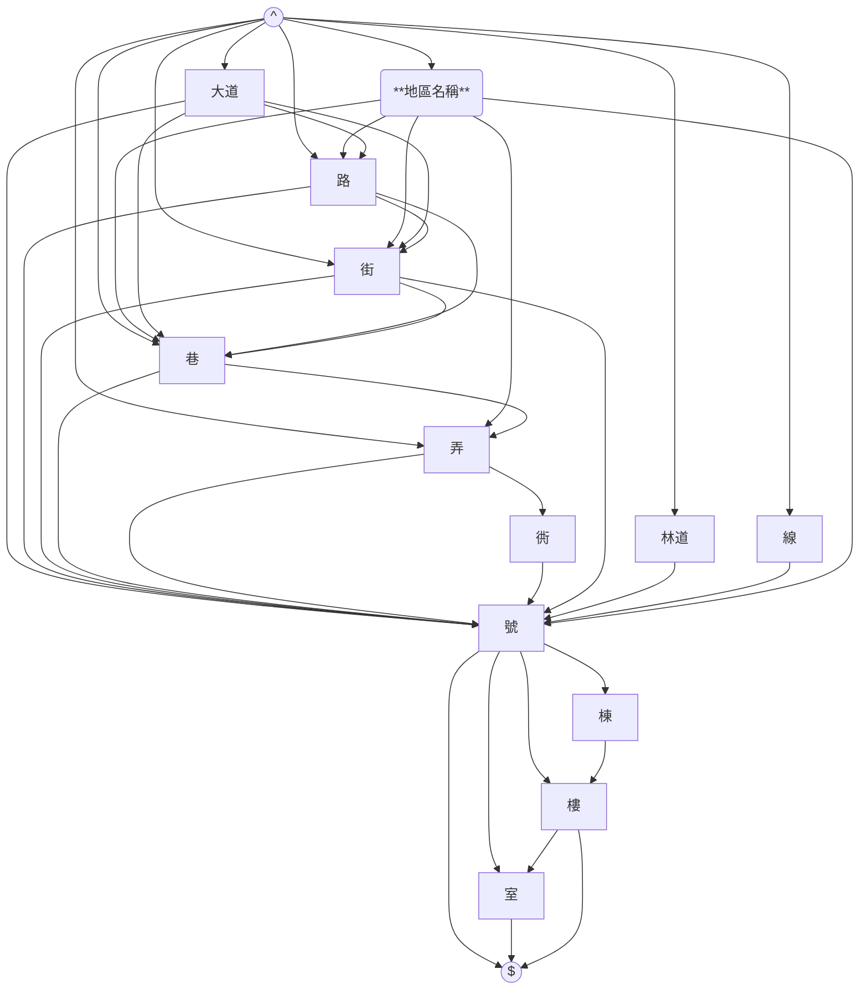

# 實驗性功能
## PostalAddress
> 台灣地址

### 結構
#### 區域

```mermaid
    flowchart TD

    AREA_START(( ^ ))

    AREA_START --> CITY
    AREA_START --> COUNTY

    CITY[市]
    AR[區]
    CITY --> AR

    COUNTY[縣]
    CY[市]
    TN[鎮]
    TH[鄉]
    COUNTY --> CY
    COUNTY --> TN
    COUNTY --> TH

    LIV[里]
    VIL[村]

    AR --> LIV
    CY --> LIV
    TN --> LIV
    TH --> VIL

    NBH[鄰]

    LIV --> NBH
    VIL --> NBH

    AREA_END(( $ ))

    NBH --> AREA_END
    LIV --> AREA_END
    VIL --> AREA_END
```
#### 地址

```mermaid
    flowchart TD

    ADDRESS_START((^))

    LOC(**地區名稱**)
    BLVD[大道]
    FST[林道]
    LNE[線]
    RD[路] 
    ST[街]
    LN[巷]
    AY[弄]
    SY[衖]

    ADDRESS_START --> BLVD
    ADDRESS_START --> RD
    ADDRESS_START --> ST
    ADDRESS_START --> LN
    ADDRESS_START --> AY
    ADDRESS_START --> FST
    ADDRESS_START --> LNE
    ADDRESS_START --> LOC

    LOC --> RD
    LOC --> ST
    LOC --> LN
    LOC --> AY

    BLVD --> ST
    BLVD --> RD
    BLVD --> LN
    
    RD --> ST
    RD --> LN

    ST --> LN

    LN --> AY

    AY --> SY

    NO[號]

    BLVD --> NO
    RD --> NO
    ST --> NO
    LN --> NO
    AY --> NO
    SY --> NO
    ST --> NO
    FST --> NO
    LNE --> NO
    LOC --> NO
    
    BD[棟]
    LV[樓]
    RM[室]

    NO --> BD
    NO --> LV
    NO --> RM
    
    BD --> LV

    LV --> RM

    NO --> ADDRESS_END
    RM --> ADDRESS_END
    LV --> ADDRESS_END

    ADDRESS_END(( $ ))
```

<!--
```mermaid
    flowchart TD
    
```
-->